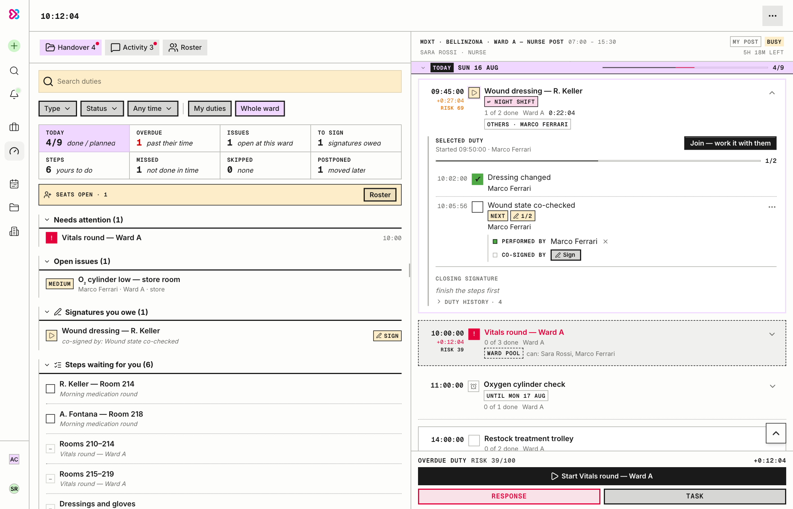
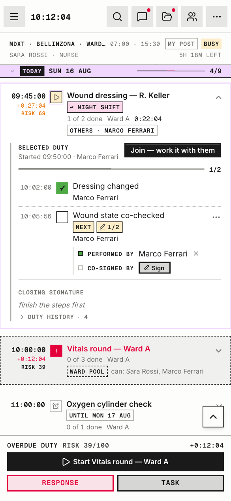
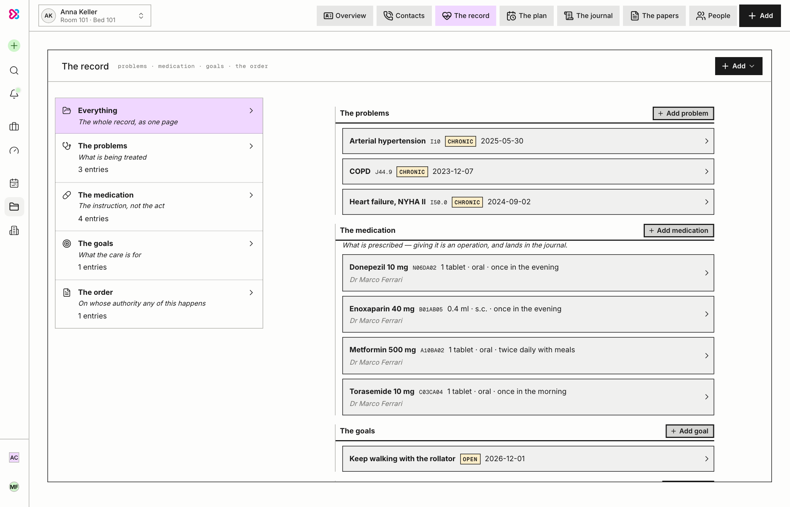
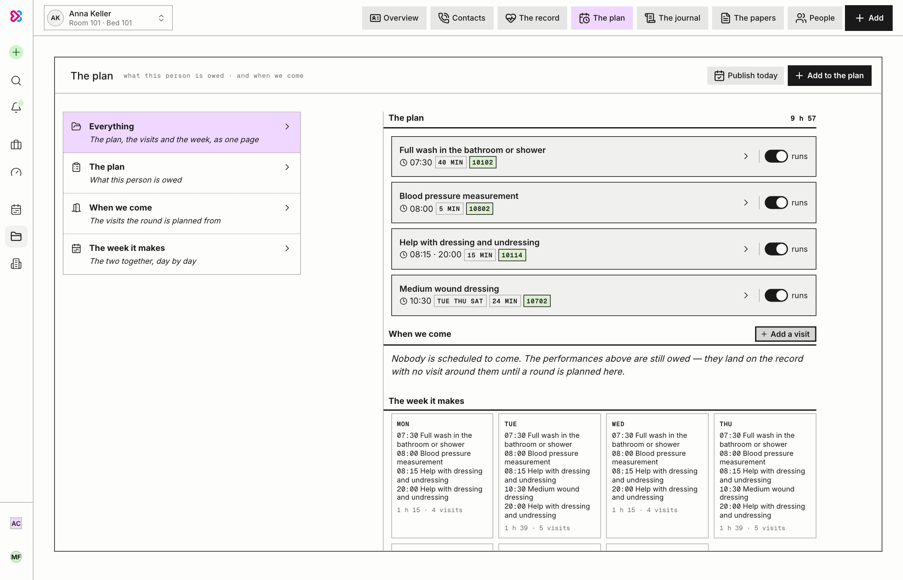
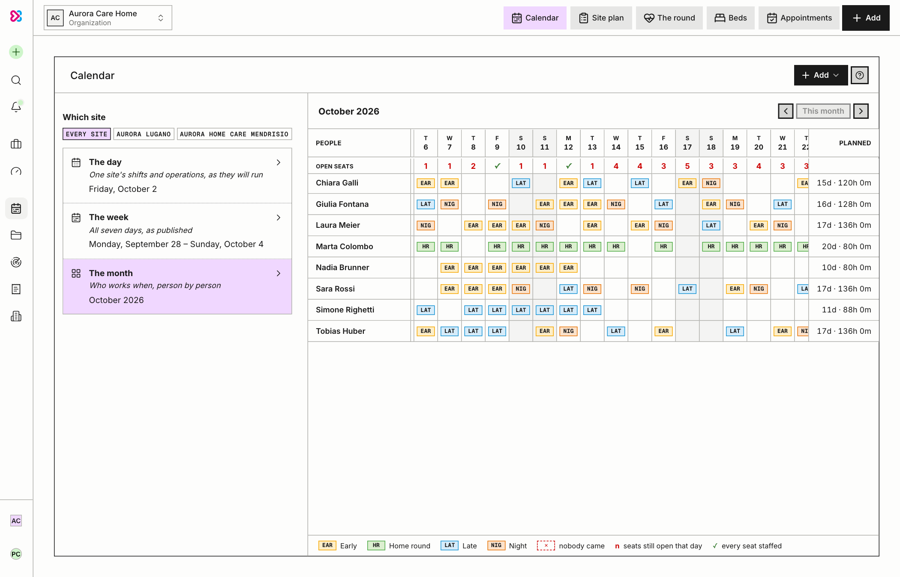
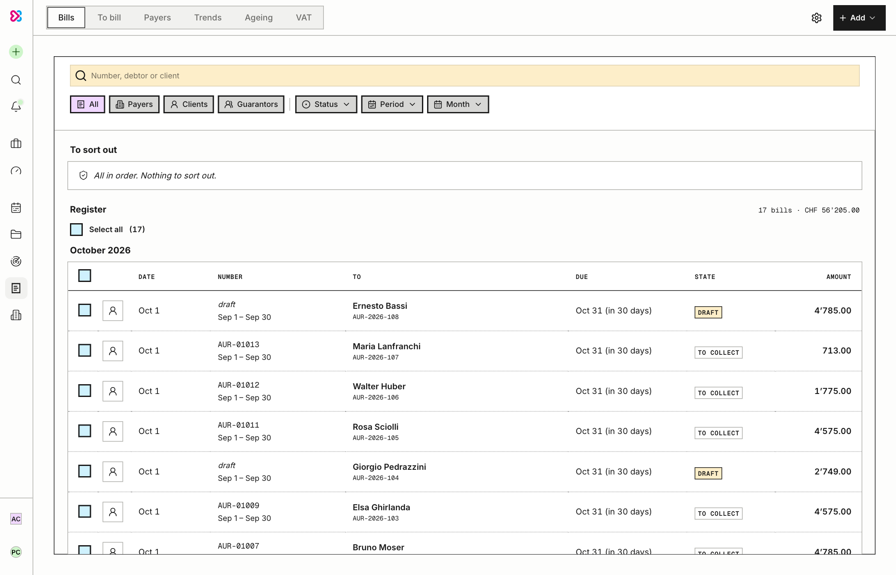
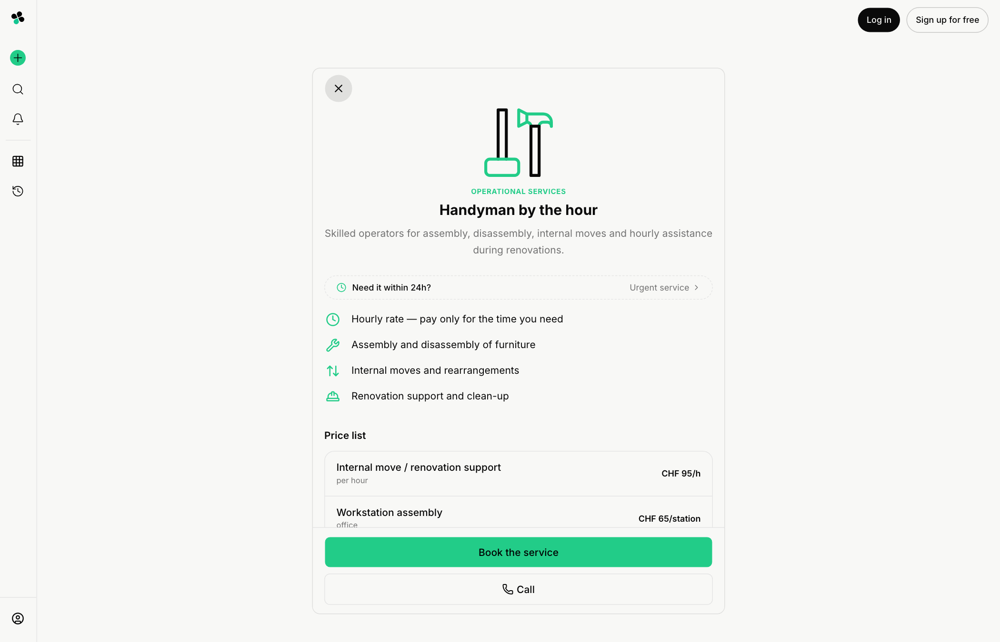

<div align="center">

# Dario Dabic

### I build operational systems from zero: idea → product → architecture → code → AI layer → production.

**Founder-builder · Lugano, Switzerland**

[](https://github.com/ddabic86)
[](https://github.com/ddabic86)

</div>

---

## What I build

I build software for real-world operations.

Not generic templates.
Not landing pages.
Not dashboard-only software.
Not isolated CRUD apps dressed up as products.

I build systems where people, places, entities, roles, permissions, schedules, approvals, records, evidence, risk, priority, business rules, AI support, and execution need to stay connected.

The goal is simple:

> **Turn fragmented real-world operations into live, structured, accountable systems.**

A serious operational system should understand what happened, where it happened, who owns it, who can act on it, which entity it belongs to, what changed, what is blocked, what matters first, what risk exists, what needs approval, what needs proof, what needs history, and what should happen next.

```txt
real-world work → structure → ownership → execution → risk → priority → visibility → accountability
```

The interface is only the visible layer.

The real product is the operating model underneath.

---

## Private products

Most of my serious repositories are private because they belong to commercial platforms.

They are not separate ideas. BBGI-OPS is the operational engine; MDXT-OPS and ECPK apply the same engine to a different domain, and MiniPlatform takes its rules down to a single small business that runs for free.

### BBGI-OPS — the operational engine

<p align="center">
  
  &nbsp;
  
</p>

A generic engine for structured execution, responsibility, visibility, operational governance, priority, risk awareness, and control.

It models entities, sites, roles, permissions, scheduling, assignments, configurable procedures, execution state, evidence, escalation, risk, and history — without assuming an industry. It is built for work that needs ownership, follow-through, permissions, proof, auditability, and live operational visibility, where spreadsheets, notes, chats, and disconnected dashboards are too weak.

Its first domain is multi-site security and facilities. Space is modelled from organization down to region, site, building, floor, zone and room, with typed assets and checkpoints. Procedures are reusable templates of ordered steps — typed answers, per-step competency gates, multiple signatures, dependencies, issue flagging, and follow-up work triggered by an answer — and each site can override parts of a procedure without forking it. Planning is separate from staffing: posts carry their recurring work, shift templates define seats, and people claim seats gated by role, certification, post qualification, working-time limits and overlap checks.

On shift, the cockpit is a live timeline of the operational day: check-in and check-out as presence, join, pause, postpone, skip and assign on duties, and urgent responses that hold other work. Alarms spawn response procedures; issues are collaborative tickets linked to the duty, step and asset they came from; the handover carries what is still open into the next shift. Risk is scored 0–100 per duty, alarm, issue and site, with history, and the Command Center ranks offices and at-risk duties with their trends.

Authorization has three layers — stacked roles with per-membership permission matrices, per-item stakeholders, and overrides — and every mutation is governance-tagged and audited.

The domain layer changes per product. The engine does not.

<details>
<summary>More screenshots</summary>

| Command Center | A completed duty with its evidence |
|---|---|
|  |  |
| **Schedule** | **An issue ticket** |
|  |  |
| **Loading screen** | **On a phone** |
|  |  |

</details>

### MDXT-OPS — the engine applied to healthcare

<p align="center">
  <picture>
    <source media="(prefers-color-scheme: dark)" srcset="assets/mdxt-ops/cockpit-dark.png">
    
  </picture>
  &nbsp;
  <picture>
    <source media="(prefers-color-scheme: dark)" srcset="assets/mdxt-ops/phone-cockpit-dark.png">
    
  </picture>
</p>

Patient-centered care for nursing homes and home-care services: structures, locations, wards, rooms and beds, the people who work there, and the patients they look after.

The patient record is split into patient and episode — problems with ICD codes, medication, allergies, vaccinations, observations, documents and a journal — and access to it is granular: consent per role, a per-record access list, invitations for family and outside professionals, and logged break-glass emergency access. Every read is audited, not only every write.

Care plans are built on the Swiss national care-service catalogue and turn into each day's work. Staffing runs from recurring shift templates published into a rota, a temp market with availability matching and offers, absences, contracts and hours balances, with working-time and rest rules enforced. On shift, the cockpit shows duties with steps, co-signatures, a shift journal, a signed handover, and risk and escalation sweeps.

Completed care becomes billable items split between insurer, public payer and client, then bills with the Swiss QR-bill, payments and reminders.

<details>
<summary>More screenshots</summary>

| Patient dossier | Care plan |
|---|---|
|  |  |
| **Month rota** | **Billing** |
|  |  |
| **Loading screen** | **On a phone** |
|  |  |

</details>

### ECPK — the engine applied to buildings and field services, then opened as a platform

<p align="center">
  
  &nbsp;
  
</p>

Fragmented building and field-service work across real locations: buildings, apartments, offices, rooms, shared areas, assets, tenants, administrators, internal crews, and external service providers.

An order can be opened from the place where the problem exists, then routed, offered to crews, scheduled, tracked live on a map, executed with an on-site report — price-list lines, readings, photos, worked time and the customer's signature, working offline and syncing later — and closed with cost and completion history attached. The dispatcher's day shows what needs attention now (late or unassigned work, unanswered seats, bills to send), who is on what, absences and timesheets. One order page serves the customer and the crew: a live tracker, schedule proposals, a two-lane chat with read receipts, extra-work quotes that the customer approves, problem reports, ratings and tips, and the full history.

Recurring plans run through the same record as one-off orders, with allowances, pro-rated advance billing, pauses and cancellations. Billing is Swiss: QR-bill, quotes that turn into orders, credit notes, partial payments with camt.054 bank import, reminders by country with late interest, scheduled sends, VAT and journal export.

Then the system opened up. A service company onboards as a provider, is approved by the platform, and runs its own storefront on a subdomain or its own verified domain, with its own branding, catalog, plans and content — while dispatch, evidence, governance and billing stay shared underneath. Commercial terms are data rather than code: packages carry entitlements and limits, and platform fees, billing standing and suspension are part of the model.

AI sits on top as accountable assistance rather than authority: it translates the catalogue and invoice texts into four languages and drafts invoice wording from the work's own facts, never the numbers.

The place stays central. Orders, interventions, costs and proof accumulate against the location itself, so the history survives a change of tenant, team, or provider.

<details>
<summary>More screenshots</summary>

| The crew on the map | The on-site report |
|---|---|
|  |  |
| **A closed order** | **Invoice register** |
|  |  |
| **An invoice with its Swiss QR-bill** | **Billing trends** |
|  |  |
| **A provider's storefront** | **Loading screen** |
|  |  |

</details>

### MiniPlatform — a small, free-to-run subscription manager

<p align="center">
  
  &nbsp;
  
</p>

The same principles at the smallest scale: one business, a handful of customers, nothing paid to run it — no e-mail provider, no SMS gateway, no Redis.

People and their subscriptions live in one book, with renewals, pauses and promotions; access is handed over by a one-time WhatsApp link with a step-by-step first sign-in. A daily job prepares the reminders before a subscription ends, idempotently, for sending on WhatsApp by hand or through the Cloud API, or on Telegram. Billing issues gap-free invoices, payments and credit notes, sent as signed links, with automatic overdue reminders, the Swiss QR-bill and Italian FatturaPA XML. Roles carry a permissions matrix, and a security console handles rate limits, blocks and the activity log.

<details>
<summary>More screenshots</summary>

| People | Billing |
|---|---|
|  |  |
| **An invoice with its QR-bill** | **Roles and permissions** |
|  |  |
| **Loading screen** | **On a phone** |
|  |  |
| **Loading screen** | **On a phone** |
|  |  |

</details>

> All names, addresses, e-mail addresses and phone numbers in the screenshots are made up; every product was run locally on an invented world for them.

---

## Multi-entity operational model

Real operations are not flat. A user should not be locked to one profile, one company, one role, one building, one provider, or one workspace.

```txt
user → entity → role → permission → workflow → data scope → action
```

The same person may be owner of one business, administrator of another entity, operator inside a specific site, professional inside a care provider, manager of multiple buildings, partner assigned to a client, requester in one context and approver in another.

The important part is context. A weak system only asks who the user is. A serious operational system asks:

```txt
Who is the user?
Which entity are they acting under?
What role do they have there?
What can they see and change?
What workflow applies?
What data must stay isolated?
What action must be logged?
```

That is not simply "many users." It is structured control across multiple operational entities.

---

## Domain-modeled systems

I do not treat operational software as a collection of disconnected tables. I build around the real entities, relationships, permissions, workflows, events, risks, and actions the system needs to understand.

```txt
people → entities → places → roles → permissions → work → events → risk → action → history
```

In practice this becomes an operational ontology. The system must know the difference between a user account, a person, a role, an entity, a site, a building, an asset, a patient, a professional, a representative, a task, an operation, an approval, an incident, a risk signal, an execution record, and an audit event — and how all of those relate.

That is the difference between storing data and modeling reality. A weak system has records. A serious system has an operating model behind the records.

---

## Configurable operations

Different sites, businesses, buildings, care providers, teams, and service flows need different steps and rules. So operations are configured, not locked into hardcoded flows.

```txt
operation → steps → assignment → permission → execution → proof → history
```

An operation defines what needs to happen, who can do it, where it applies, which entity owns it, which steps are required, what evidence is needed, what role or qualification is required, what happens if it is late, blocked, skipped, or escalated, and what gets logged on completion.

The point is flexibility without chaos: each organization can follow the way work actually happens while permissions, history, proof, risk, and accountability stay structured.

---

## Operational governance

Roles, permissions, restrictions, approvals, audit logs, escalation paths, and accountability rules are part of the product foundation, not secondary features. This matters most where work is sensitive, regulated, delegated, or shared between different people, businesses, providers, and organizations — the real problem is not access, it is controlled participation.

```txt
entity → role → permission → action → restriction → history → accountability
```

Governance means the system can answer who can see, change, or approve something, which entity owns the record, which role the user was acting under, what happened and why, what was blocked or overridden, and who is responsible next.

Without governance, operational software becomes chaos.

---

## Risk and priority

Not everything has the same weight. Some work can wait, some work blocks other work, and some work creates financial, clinical, safety, or service risk.

```txt
signal → risk → priority → escalation → action
```

Risk is not a static label someone sets once. It is derived from execution state and moves in both directions as the operation progresses: completing a required step, attaching missing evidence, or clearing an approval lowers it, while a skipped, blocked, late, or unassigned step raises it.

```txt
required step completed, evidence attached, approval cleared   → risk down
step skipped, blocked, overdue, unassigned, or repeated        → risk up
```

Nobody has to remember to lower the score by hand, and it does not sit frozen at the level it was created with. It follows the work.

The point is not to generate fake AI scores. Risk must be explainable: a user should understand why something is urgent, blocked, overdue, sensitive, repeated, or unsafe.

Good operational software does not only show a list of work. It helps decide what needs attention now.

---

## Main stack

```txt
Frontend         Next.js · React · TypeScript · Tailwind · shadcn/ui
Backend          Node.js · Fastify · tRPC · API routes · server actions
Database         PostgreSQL · Prisma ORM · relational domain modeling
State/Data       TanStack Query · Zustand · typed API flows
Realtime         Socket.io · Redis · live operational updates
Workers          BullMQ · background jobs · scheduled processing
Auth             custom auth flows · sessions/JWT · 2FA · passkeys/WebAuthn
Security         hashing · rate limiting · CSRF protection · protected actions · audit logs
Authorization    role-based · scoped · entity-aware access control
Architecture     multi-entity account model · organization/site scoping · multi-tenant-ready structure
Infra            AWS · S3 · SES · SNS · deployment pipelines · production config
AI Layer         scoped AI assistance · document parsing · structured automation
```

The stack matters, but it is not the advantage by itself. The advantage is knowing how to turn messy operational reality into a working product model.

---

## Product principles

```txt
1.  The workflow is the product.
2.  The system must model the real-world domain.
3.  Data without structure becomes noise.
4.  Notes are not operations, and dashboards are weak if nothing can be executed from them.
5.  Permissions, governance and history matter before scale, not after.
6.  Risk and priority must be explainable.
7.  Operations should be configurable, not hardcoded.
8.  A user may control or participate in multiple operational entities.
9.  AI should support operations, not pretend to replace them.
10. Good software reduces coordination; weak software creates more.
11. If the logic is weak, the UI is decoration.
```
